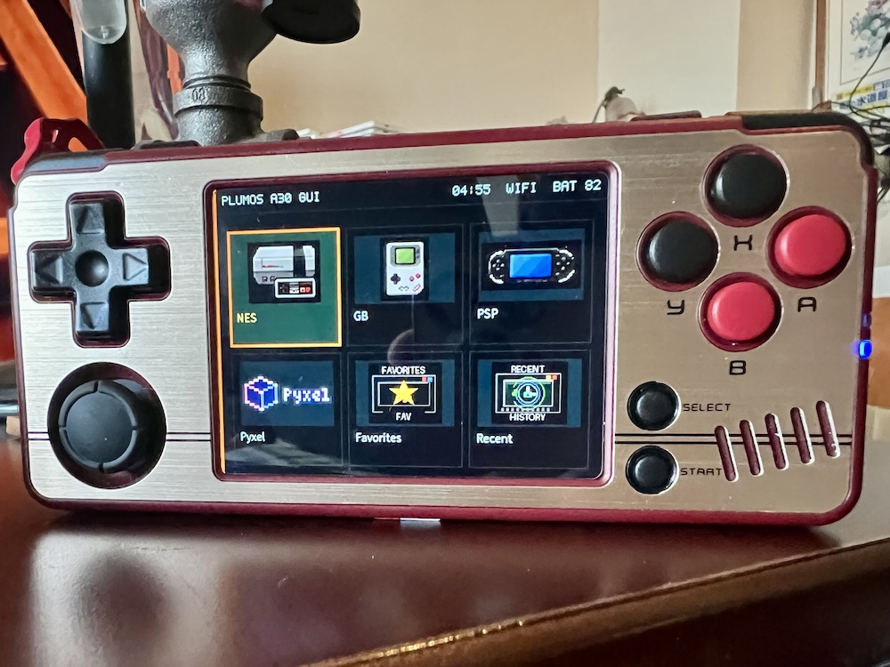
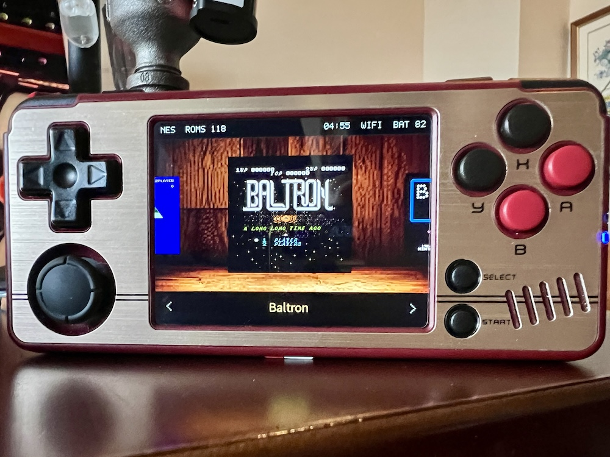
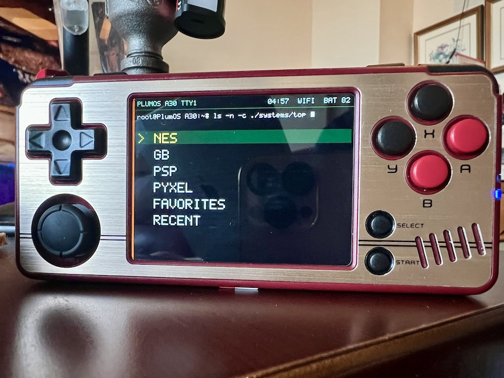

# plumOS A30

<p align="center">
  
</p>

<table>
  <tr>
    <td width="33%" align="center">
      <br>
      <sub>Graphic TOP</sub>
    </td>
    <td width="33%" align="center">
      <br>
      <sub>Gallery ROM list</sub>
    </td>
    <td width="33%" align="center">
      <br>
      <sub>Text TOP</sub>
    </td>
  </tr>
</table>

plumOS は Miyoo A30 向けの SD カード配布型カスタム環境です。A30 本体の rootfs/NAND を
原則書き換えず、SD カード上の `plumos/` に frontend、launcher、emulator runtime、
設定、ログ、補助ツールを集約します。

ユーザーは配布アーカイブをフォーマット済み SD カードの root に展開して起動します。
開発者は Docker toolchain で A30 向け runtime、RetroArch/libretro core、PicoArch、
standalone emulator、frontend を再ビルドできます。

## ドキュメント

読む人ごとに入口を分けています。

- [ユーザー向けガイド](docs/user/README.ja.md)
  - インストール
  - 基本操作
  - SD カードのディレクトリ構成
  - 対応システム/エミュレータ一覧
  - ネットワークサービス、USB Disk Mode、スクレイピング
- [開発者向けガイド](docs/developer/README.ja.md)
  - 技術構成
  - Docker build の始め方
  - plumOS 機能逆引き
  - runtime package / SD root package / release asset の作り方
  - A30 実機への deploy と検証
  - 既存の詳細設計文書への入口
- [機能逆引き](docs/developer/feature-index.ja.md)
- [全ドキュメント索引](docs/README.ja.md)
- [英語 README](README.md)
- [英語ドキュメント索引](docs/README.md)
- [TODO](TODO.ja.md)

GitHub で既定表示される英語版を `.md` に置き、日本語版は同じ path の `.ja.md` に置きます。

## ユーザー向け配布物

現在のエンドユーザー向け配布物は SD カード root に直接展開する `.7z` アーカイブです。

```text
dist/plumos-sdroot-package.7z
```

展開後の SD カード直下には、主に以下が配置されます。

```text
App/
Bios/
Emu/
Images/
Imgs/
RApp/
RetroArch/
Roms/
Saves/
Themes/
miyoo/
plumos/
```

ROM、BIOS、save/state、スクリーンショット、動画、ネットワーク秘密情報、個人の SSH 公開鍵は
配布物に含めません。

## 開発の基本ループ

Docker image を作成します。

```sh
./scripts/docker-build.sh image
```

必要な component を build します。

```sh
./scripts/docker-build.sh frontend
./scripts/docker-build.sh retroarch-practical
./scripts/docker-build.sh libretro-cores
./scripts/docker-build.sh picoarch
./scripts/docker-build.sh standalone-emulators
```

A30 実機への command 実行と deploy は helper script を使います。

```sh
./scripts/run-a30.sh 'uname -a'
./scripts/deploy-a30.sh dist/plumos-frontend /mnt/SDCARD
./scripts/a30-fe-control.sh restart
./scripts/a30-fe-control.sh status
```

詳しい build 手順は [Docker ビルドガイド](docs/developer/build.ja.md) を参照してください。

## 重要な方針

- A30 rootfs/NAND は原則書き換えません。
- plumOS の永続ファイルは原則 `/mnt/SDCARD/plumos/` に集約します。
- StockOS 由来の SD payload は fallback と互換性のために配布物へ含めます。
- libretro core は Onion が採用している source 時期を優先し、plumOS 側で source からビルドします。
- ROM/BIOS はユーザー自身が用意します。

## 参考

- [plumOS 設計方針](docs/plumos-design-policy.ja.md)
- [release artifact 方針](docs/release-artifacts.ja.md)
- [runtime package](docs/runtime-package.ja.md)
- [SD root package](docs/sdroot-package.ja.md)
